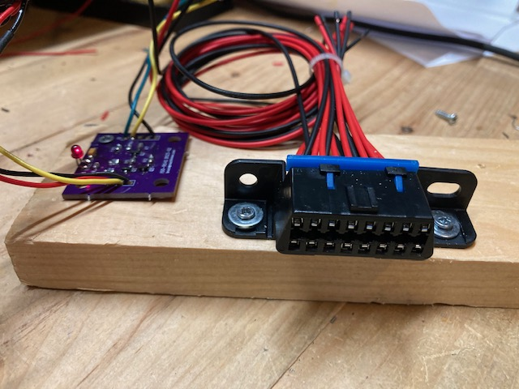

Overview
========

A simple simluator of an OBD2 vehicle ECU.  This is used to test OBD2 scanners and other test tools.

Hardware Notes
==============

Here's what the simulator looks like:

The purple PCB was designed and manufactured specifically for this application.  Please see [this related project](https://github.com/brucemack/iso9141-interface) for more information about the hardware implementation.

Software Notes
==============

The ISO document that describes the physical interface is [here](https://andrewrevill.co.uk/ReferenceLibrary/OBDII%20Specifications%20-%20ISO-9141-2%20(Physical).pdf)

Please see [this page](https://en.wikipedia.org/wiki/OBD-II_PIDs) for a list of the PIDs used.
